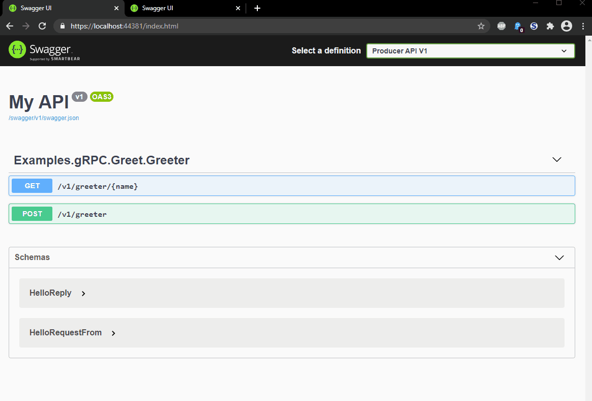

# gRPC with .Net 5 and Swashbuckle

Google's general-purpuse Remote Procedure Calls is typesafe way to connect services.

## Requirements
* [Visual Studio 2019](https://visualstudio.microsoft.com/downloads/)
* [.Net 5](https://dotnet.microsoft.com/download)

### Live Demo

### Links

* https://github.com/stevejgordon/gRPC-Demos
* https://docs.microsoft.com/de-de/aspnet/core/grpc/clientfactory?view=aspnetcore-5.0

